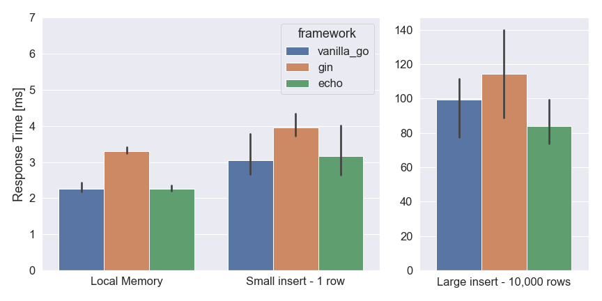

# web-framework-tests

Testing the performance of several Go and Python web frameworks

## About

This projects implements the same API in several different backend frameworks, and it aims to test the performance of each framework with minimal configuration.

Currently supported frameworks:

- Vanilla Go (built-in http package)
- Gin (Go)
- Echo (Go)

To-do:

- FastAPI (Python)
- Flask (Python)

Performance is tested for both local data handling and for saving data to a Postgres database.

This project also includes a profiler client (in Python) that tests each framework and compares the results. The project uses simulated battery cell test data (what I'm most familar with :smile:).

## Results

| Framework  | Local Memory | Small Insert | Large Insert |
|------------|--------------|--------------|--------------|
| Vanilla Go | 2.25         | 3.16         | 83.77        |
| Gin        | 3.31         | 3.97         | 114.3        |
| Echo       | 2.25         | 3.16         | 83.77        |

All response times shown in milliseconds.

The test measured response time for three different tests:
- Local Memory: A single row of data is saved to the web server's local memory
- Small insert: A single row of data is inserted into the database
- Large insert: 10,000 rows of data are inserted into the database

All measured values are the average response time across three runs, and error ranges show the 95% confidence interval. Raw data and analysis is in the `/profiler` directory.

## Setup
- Install Go (≥ 1.17) and Python (≥ 3.8)
- From the `/profiler` directory, run `pip install -r requirements.txt` to install Python dependencies.
- From each framework directory, run `go mod tidy` to install Go dependencies
- For each framework, run `go run cmd/main.go` to start the web server, then from the `/profiler` directory run `python run_test.py` to run the test

## Notes

This should not be considered a standardized benchmark test, as it was mainly intended as a project that measures performance with little configuration. Benchmark tests typically include a number of hardware and software optimizations that result in performance numbers much higher than those achieved here. 

[Tech Empower's Web Framework Benchmarks](https://www.techempower.com/benchmarks/) are a much better source for performance comparisons.